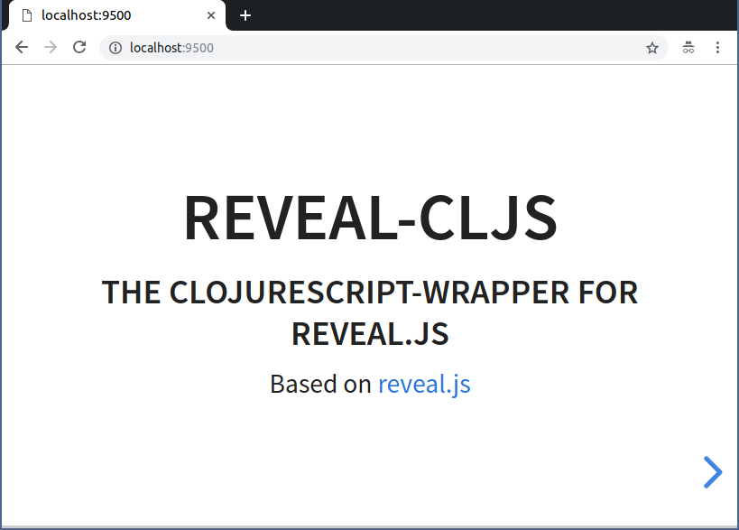

# reveal-cljs

Inspired by the great work on [reveal.js](https://github.com/hakimel/reveal.js/)
and the dislike towards JavaScript, this small project was created to provide a
simple wrapper in ClojureScript to create awesome presentations.

It uses Hiccup-syntax for templating, which makes it very easy to create slides.

Start the project with `clj -m figwheel.main -b dev -r` and see your live
slides. Start *speaker-mode* by pressing <kbd>s</kbd> in the slides in your
browser (thanks to @kazesberger)

## Requirements

Tested with JDK 8 and JDK 11.

Also [Clojure's CLI Tools](https://clojure.org/guides/getting_started) and
[yarn](https://yarnpkg.com/en/) / [npm](https://www.npmjs.com/) are necessary to
build and run the project.

## Usage

Set your desired options in
[core.cljs](https://github.com/n2o/reveal-cljs/blob/master/src/reveal/core.cljs#L10).
More options can be found
[here](https://github.com/hakimel/reveal.js#configuration).

Create your slides in
[slides.cljs](https://github.com/n2o/reveal-cljs/blob/master/src/reveal/slides.cljs)
and add them to the list in the function `all`.

Then start the development server as seen in the Setup section.

## Installation & Setup

Download the dependency reveal.js (specified in `package.json`) with:

    yarn install
    
or clone the repository:

    git clone git@github.com:hakimel/reveal.js.git resources/public/node_modules/reveal.js

To get an interactive development environment run:

    clj -m figwheel.main -b dev -r

`-b` indicates the targeted build `dev`, which can be configured in
`dev.cljs.edn`.

`-r` opens a REPL.

Figwheel opens your browser at [localhost:9500](http://localhost:9500/). This
will auto compile and send all changes to the browser without the need to
reload.

Open Speaker Notes by pressing <kbd>s</kbd>.

## License

Copyright © 2016-2019 Christian Meter and Contributors

Distributed under the [MIT](LICENSE) License version.
